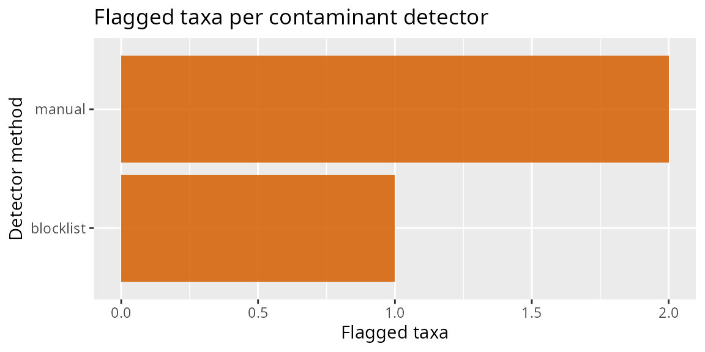

# Detecting and removing contaminants

``` r
library(tidypq)
#> Loading required package: phyloseq
#> Loading required package: MiscMetabar
#> Loading required package: ggplot2
#> Loading required package: dplyr
#> 
#> Attaching package: 'dplyr'
#> The following objects are masked from 'package:stats':
#> 
#>     filter, lag
#> The following objects are masked from 'package:base':
#> 
#>     intersect, setdiff, setequal, union
library(MiscMetabar)
```

## The detect-then-filter design

tidypq splits contamination handling into two steps:

1.  **Detect.** Each `identify_contam_*_pq()` function flags suspect
    taxa using a different signal, and returns a `contam_tbl` – a tibble
    with one row per flagged taxon, a `method` column, and
    method-specific *evidence* columns. A detector never modifies the
    phyloseq object.
2.  **Filter.** The single verb
    [`filter_contam_pq()`](https://adrientaudiere.github.io/tidypq/reference/filter_contam_pq.md)
    consumes any `contam_tbl` (or several, combined) and removes the
    flagged taxa.

| Detector                                                                                                                | Signal                                     | Needs                   |
|-------------------------------------------------------------------------------------------------------------------------|--------------------------------------------|-------------------------|
| [`identify_contam_blocklist_pq()`](https://adrientaudiere.github.io/tidypq/reference/identify_contam_blocklist_pq.md)   | genus on a known-contaminant blocklist     | `tax_table`             |
| [`identify_contam_corr_pq()`](https://adrientaudiere.github.io/tidypq/reference/identify_contam_corr_pq.md)             | abundance correlates negatively with depth | counts                  |
| [`identify_contam_primer_pq()`](https://adrientaudiere.github.io/tidypq/reference/identify_contam_primer_pq.md)         | representative sequence embeds a primer    | `refseq`, Biostrings    |
| [`identify_contam_chimera_pq()`](https://adrientaudiere.github.io/tidypq/reference/identify_contam_chimera_pq.md)       | chimeric sequence (dada2 or vsearch)       | `refseq`, dada2/vsearch |
| [`identify_contam_negcontrol_pq()`](https://adrientaudiere.github.io/tidypq/reference/identify_contam_negcontrol_pq.md) | occurrence pattern in negative controls    | control samples         |

“Contaminant” here is a broad umbrella: technical artefacts (chimeras,
primer read-through), reagent/lab contaminants, and cross-sample
contaminants are all sub-types flagged by one detector or another.

## A first detector

The blocklist detector needs only a taxonomy table. `data_fungi` is
fungal, so the default bacterial blocklist matches nothing; we extend it
with a genus present in the data for illustration.

``` r
flagged <- identify_contam_blocklist_pq(data_fungi, extra_genera = "Mortierella")
#> ℹ blocklist: flagged 1 of 1420 taxa from 84 blocklist genera.
flagged
#> contam_tbl: 1 flagged taxon from method "blocklist"
#> # A tibble: 1 × 5
#>   taxon   method    genus       total_reads prevalence
#>   <chr>   <chr>     <chr>             <dbl>      <dbl>
#> 1 ASV1215 blocklist Mortierella         118          1
```

A `contam_tbl` always starts with `taxon` and `method`; the remaining
columns are the evidence specific to that detector.

``` r
names(flagged)
#> [1] "taxon"       "method"      "genus"       "total_reads" "prevalence"
```

## Removing flagged taxa

[`filter_contam_pq()`](https://adrientaudiere.github.io/tidypq/reference/filter_contam_pq.md)
removes the flagged taxa by name and returns the cleaned phyloseq
object. When nothing is flagged it returns the object unchanged.

``` r
data_clean <- filter_contam_pq(data_fungi, flagged)
#> ! Removing 1 contaminant taxon flagged by method "blocklist".
data_clean
#> phyloseq-class experiment-level object
#> otu_table()   OTU Table:         [ 1419 taxa and 185 samples ]
#> sample_data() Sample Data:       [ 185 samples by 7 sample variables ]
#> tax_table()   Taxonomy Table:    [ 1419 taxa by 12 taxonomic ranks ]
#> refseq()      DNAStringSet:      [ 1419 reference sequences ]
```

## Combining detectors

Because every detector returns the same object, their outputs compose
with [`rbind()`](https://rdrr.io/r/base/cbind.html) – evidence columns
missing from one detector are filled with `NA`, and
[`filter_contam_pq()`](https://adrientaudiere.github.io/tidypq/reference/filter_contam_pq.md)
removes the union of the flagged taxa.

``` r
blocklist <- identify_contam_blocklist_pq(
  data_fungi,
  extra_genera = "Mortierella",
  verbose = FALSE
)

# A second (here, hand-built) contam_tbl standing in for another detector
manual <- new_contam_tbl(tibble::tibble(
  taxon = taxa_names(data_fungi)[1:2],
  method = "manual"
))

combined <- rbind(blocklist, manual)
combined
#> contam_tbl: 3 flagged taxons from methods "blocklist" and "manual"
#> # A tibble: 3 × 5
#>   taxon   method    genus       total_reads prevalence
#>   <chr>   <chr>     <chr>             <dbl>      <dbl>
#> 1 ASV1215 blocklist Mortierella         118          1
#> 2 ASV2    manual    NA                   NA         NA
#> 3 ASV6    manual    NA                   NA         NA

data_clean <- filter_contam_pq(data_fungi, combined)
#> ! Removing 3 contaminant taxons flagged by methods "blocklist" and "manual".
```

## Diagnostics

A lightweight overview of how many taxa each method flagged is available
through the [`plot()`](https://rdrr.io/r/graphics/plot.default.html) /
[`autoplot()`](https://ggplot2.tidyverse.org/reference/autoplot.html)
method on a `contam_tbl`. Publication-grade contamination figures live
in the companion `ggplotpq` package and consume the same `contam_tbl`.

``` r
plot(combined)
```



## Negative-control classification

When the design includes negative/blank controls,
[`identify_contam_negcontrol_pq()`](https://adrientaudiere.github.io/tidypq/reference/identify_contam_negcontrol_pq.md)
classifies the taxa seen in those controls into sub-types. Only
`artifact` and `lab_contaminant` are flagged by default; add
`sample_contaminant` to `flag_categories` to be more aggressive.

``` r
pq <- mutate_samdata_pq(
  data_fungi,
  is_control = sample_sums(.) < sort(sample_sums(.))[4]
)

nc <- identify_contam_negcontrol_pq(pq, is_control)
#> ℹ negcontrol: flagged 0 taxa (artifact=0, lab_contaminant=0).
nc
#> ✔ contam_tbl: no flagged taxa.
#> # A tibble: 0 × 9
#> # ℹ 9 variables: taxon <chr>, method <chr>, subtype <chr>, total_reads <dbl>,
#> #   reads_in_neg <dbl>, reads_in_samples <dbl>, n_neg_samples <dbl>,
#> #   n_non_neg_samples <dbl>, ratio_non_neg_to_neg <dbl>
```

## Abundance-, sequence-, and chimera-based detectors

The remaining detectors follow the identical pattern; they are shown
here without evaluation because they need extra data or packages.

``` r
# Correlation of relative abundance with sequencing depth (GRIMER-inspired)
corr <- identify_contam_corr_pq(data_fungi, contam_threshold = -0.5)

# Taxa whose representative sequence embeds a primer (needs Biostrings + refseq)
primers <- c(fwd = "CCCTACGGGGTGCASCAG", rev = "GGACTACVSGGGTATCTAAT")
prim <- identify_contam_primer_pq(data_fungi, primers)

# Chimeras, de novo (dada2) or reference-based (vsearch)
chim <- identify_contam_chimera_pq(data_fungi, method = "dada2")

# One filter call removes everything flagged
data_clean <- filter_contam_pq(
  data_fungi,
  rbind(corr, prim, chim)
)
```

## Control-based decontamination (a different tool)

[`decontam_control_samples_pq()`](https://adrientaudiere.github.io/tidypq/reference/decontam_control_samples_pq.md)
and
[`decontam_control_taxa_pq()`](https://adrientaudiere.github.io/tidypq/reference/decontam_control_taxa_pq.md)
are *not* detectors and do not produce a `contam_tbl`. Instead of
flagging whole taxa, they estimate a background level from a control set
and **zero out individual occurrences** at or below it – a per-cell
correction. The control reference is either negative/blank control
*samples* or spike-in control *taxa*.

``` r
# Background estimated from control SAMPLES, per taxon
pq <- mutate_samdata_pq(data_fungi, is_control = sample_sums(.) < 500)
decontam_control_samples_pq(pq, is_control)

# Background estimated from control TAXA (e.g. spike-ins), per sample
decontam_control_taxa_pq(data_fungi, Genus == "Tintelnotia")
```
